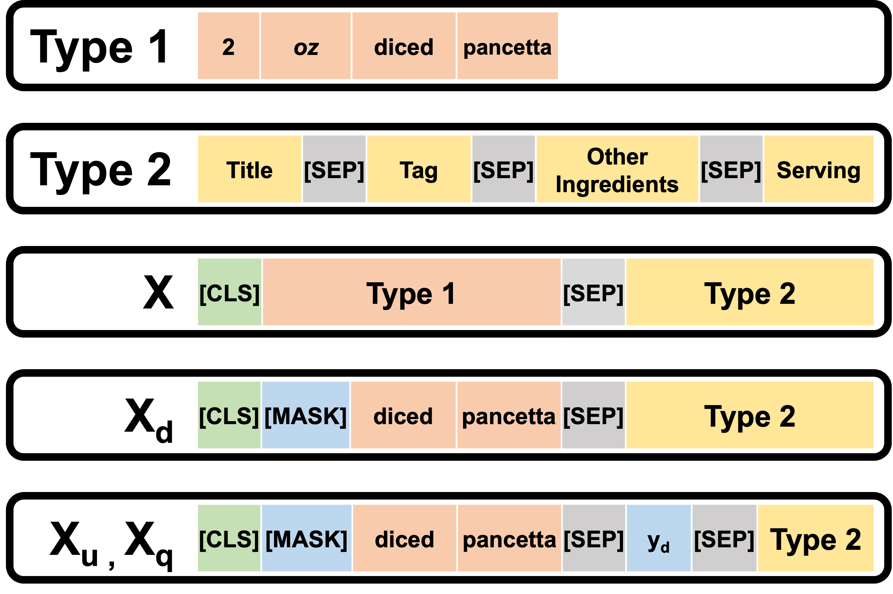

# KitchenScale 
This repository is an implemenation of **KitchenScale**, a food numeracy model capable of suggesting the exact quantity of the target ingredient with units given a recipe context.

> **KitchenScale : Learning Food Numeracy from Recipes through Context-Aware Ingredient Quantity Prediction** <br>
> Donghee Choi, Keonwoo Kim, Samy Badreddine, Hajung Kim, Donghyeon Park, Jaewoo Kang
> Submitted in CIKM 2022
> You can try  our demo version of **KitchenScale**
> *http://kitchenscale.korea.ac.kr/* ( Under construction )
>
> For more details to find out what we do, pleas visit *https://dmis.korea.ac.kr*

* Our work was done by [DMIS-lab](https://dmis.korea.ac.kr/) collaborating with [SonyAI](https://ai.sony/).


<!--  -->
<!--  -->

## Download

* [Dataset](https://www.dropbox.com/s/f6meyqlj4ep8flj/data.tar.gz?dl=0)
   * Uncompress the file into ./data folder
* [Task1 Measurement Type prediction checkpoint](https://www.dropbox.com/s/p56mulyquthdlct/dim.ckpt?dl=0)
* [Task2 Unit prediction checkpoint](https://www.dropbox.com/s/lu9qykkox5s1jbm/unit.ckpt?dl=0)
* [Task3 Quantity prediction checkpoint](https://www.dropbox.com/s/8ew1wij89v6m7q6/ing_q.ckpt?dl=0)
  *  To get inference results, move the checkpoints into ./checkpoints folder


## Prerequisite
This project is tested with Python 3.8, Pytorch 1.9, CUDA 11.1, Huggingface Transformer 4.12.2

## Installation

```bash
git clone https://github.com/dmis-lab/KitchenScale.git
cd KitchenScale; pip install -r requirements.txt
```

## Training
* For different tasks, change exp_ver to (dim, unit, ing_q)

```bash
python train.py \
  --name=ing_q_train \
  --proj_name=test_project \
  --food_data_path=./data \
  --gpus=2 \
  --batch_size=32 \
  --max_epochs=80 \
  --data_size=all \
  --learning_rate=1e-6 \
  --auto_select_gpus=True \
  --is_q_predict \
  --is_e_predict \
  --regression_layer=3mlp \
  --gradient_clip_val=0.5 \
  --drop_rate=0.3 \
  --exp_ver=ing_q \
  --is_include_ing_phrase \
  --is_include_dimension \
  --is_include_tags \
  --is_include_title \
  --is_include_other_ing \
  --is_include_serving \
  --q_ing_phrase_ver=ing_name_q_u_mask \
  --strategy=ddp \
  --save_top_k=10 \
  --patience=3 \
  --early_stopping_metric=val_loss \
```

## Inference

```bash
python infer.py
```

## Acknowledgement
Our work was done by DMIS-lab collaborates with Sony AI and their Gastronomy Flagship Project, it is an extension idea for making an AI for assisting recipe creation which the goal is interactively helping chefs create creative but delicious and healthy recipes.
